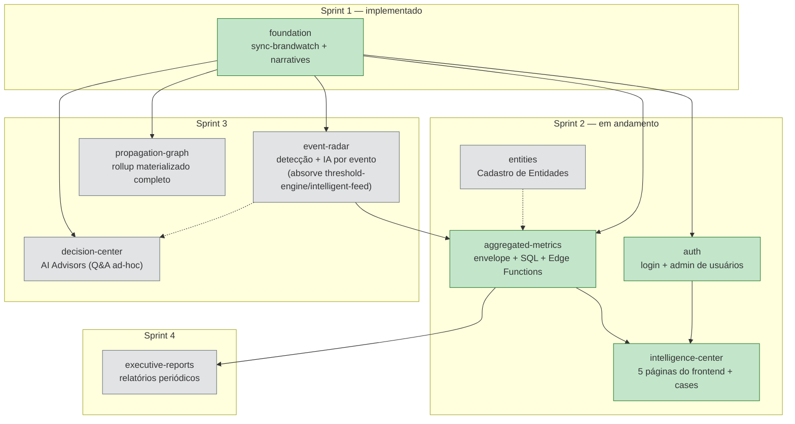

# Mapa de Arquitetura — Digital Intelligent Communication

> Documento obrigatório do skill `spec-driven-dev` (regra adicionada em 2026-07-13, a pedido do
> usuário — ver "Mapa de arquitetura geral" no `SKILL.md`). Existe pra dar, num único lugar, a
> visão que só estava espalhada entre `_index.md` (tabela de módulos) e o `_fluxo-*.md` de
> `event-radar`↔`aggregated-metrics` (o único par que tinha diagrama até aqui). **Atualizar
> sempre que um módulo for criado, mudar de status, ou ganhar/perder uma dependência** — se este
> arquivo e `_index.md` divergirem, é bug de documentação, não algo aceitável de conviver.
>
> Este arquivo responde "o que é cada módulo e como eles se conectam". Pra "o que está pendente
> de decisão ou de código dentro de cada módulo", ver [_pending.md](_pending.md).

## 1. Diagrama de dependências entre todos os módulos

**Como ler**: seta cheia (`-->`) = dependência forte, o módulo de origem bloqueia o de destino.
Seta pontilhada (`-.->`) = dependência fraca/opcional — o destino funciona sem a origem (com
fallback), mas fica mais completo com ela.

`threshold-engine` e `intelligent-feed` (módulos que existiam na tabela original de `_index.md`,
Sprint 3) não aparecem como nós próprios — foram **absorvidos por `event-radar`** antes de
ganhar spec própria, ver `_index.md`, "Fusão de módulos". `command-center` também não aparece
mais (removido 2026-07-13) — o único requisito real (`cases`, schema mínimo) virou dado próprio
de `intelligence-center`, ver `_index.md`, "Módulo `command-center` removido".

## 2. Legenda

| Estilo | Significado |
|---|---|
| 🟩 Verde | `implementado` — já em produção (ver `CLAUDE.md` para o estado exato de cada peça) |
| 🟨 Amarelo | `pronto` — spec aprovada, aguardando implementação |
| ⬜ Cinza | `rascunho` — spec ainda em elaboração ou nem começada, não implementar |
| Seta pontilhada | Dependência fraca/opcional (fallback existe sem o módulo de origem) |

> ✅ **`auth` passou a verde em 2026-07-13**: as 4 specs do módulo
> (`data-model.md`, `login.md`, `password-recovery.md`, `user-management.md`)
> estão todas `implementado` — `middleware.ts` + `/login` + `/forgot-password`
> + `/reset-password` + `/admin/users` + `/perfil` (fuso horário do usuário)
> + as 6 Edge Functions `admin-*` + `update-my-timezone`. Ver `CLAUDE.md`,
> "Módulo auth (Sprint 2)", pro detalhe completo de implementação.

> ✅ **`aggregated-metrics`/`intelligence-center` passaram a verde em
> 2026-07-16** (correção de doc desatualizada — este arquivo ainda dizia
> "pronto — não implementado" para os dois, mas ambos já estavam
> genuinamente implementados desde 2026-07-14/15: `sql-aggregation.md`'s 9
> functions SQL, `service-layer-aggregation.md`'s `assemblePageResponse`,
> as 6 Edge Functions `get-page-*`/`get-narrative-detail`, e as 5 páginas
> de `intelligence-center` (Executive Overview/Narrativas/Sentimento/
> Plataformas/Pautas Eleitorais) — ver `CLAUDE.md`, "aggregated-metrics
> module (Sprint 2)" e "edge-functions-per-page.md + the 5
> intelligence-center pages". `intelligence-center` fica com a ressalva
> "`cases` ainda não" (schema mínimo de ações/decisões, sem migration —
> gap #20 de `_pending.md`); `aggregated-metrics` com "`get_active_highlights`/
> região/síntese de página pendentes" (gaps #8/#9/#7 de `_pending.md`) —
> nenhum dos dois bloqueia o restante do módulo, por isso verde e não
> amarelo (mesmo critério já usado para `auth` acima, que também tem gaps
> menores documentados sem ficar amarelo por causa deles).

## 3. Módulos (resumo)

| Módulo | O que é | Status | Spec |
|---|---|---|---|
| `foundation` | Sync Brandwatch → Supabase + Narrativas como entidade viva | implementado | [foundation/overview.md](foundation/overview.md) |
| `auth` | Login/recuperação de senha (Supabase Auth) + administração de usuários (admin-only) + `/perfil` (fuso horário) | implementado | [auth/overview.md](auth/overview.md) |
| `entities` | Cadastro Nacional de Entidades (partido/espectro/cargo) + enriquecimento de mentions | rascunho | — |
| `intelligence-center` | As 5 páginas do frontend (Executive Overview, Narrativas, Sentimento, Plataformas, Pautas Eleitorais) + `cases` (ações/decisões, ex-`command-center`) | implementado — `cases` (schema) ainda não | [intelligence-center/overview.md](intelligence-center/overview.md) |
| `aggregated-metrics` | Envelope JSON único + SQL de agregação + Edge Functions por página, consumido pelo frontend e pela IA | implementado — `get_active_highlights`/região/`page_narrative_synthesis` pendentes, ver `_pending.md` | [aggregated-metrics/overview.md](aggregated-metrics/overview.md) |
| `event-radar` | Detecção estatística de picos/quedas/mudanças + 1 card de IA por evento — absorve `threshold-engine`/`intelligent-feed` | rascunho | [event-radar/overview.md](event-radar/overview.md) |
| `propagation-graph` | Grafo de propagação com rollup materializado completo (versão simplificada já em `intelligence-center/narratives-exploration.md`) | rascunho | — |
| `decision-center` | AI Advisors — perguntas livres/interativas do analista sobre mentions/narrativas | rascunho | — |
| `executive-reports` | Relatórios periódicos (diário/semanal/mensal/executivo/crise) | rascunho | — |

## Referências

- [_index.md](_index.md) — mesma informação de módulos/dependências/sprints, em tabela + texto,
  incluindo a "Sequência de implantação — Sprint 2" detalhada passo a passo.
- [_fluxo-event-radar-aggregated-metrics.md](_fluxo-event-radar-aggregated-metrics.md) — o único
  par de módulos com sincronismo complexo o bastante pra merecer um diagrama próprio, incl.
  `sequenceDiagram` de quando cada parte roda (este arquivo aqui não substitui aquele, é o mapa
  geral; aquele é o detalhe de um par específico).
