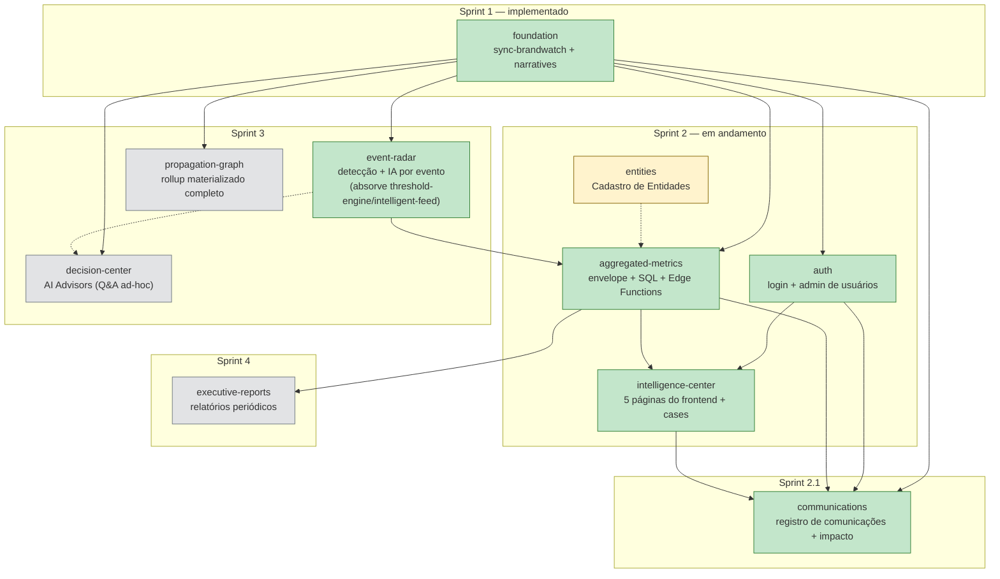

# Mapa de Arquitetura — Digital Intelligent Communication

> Documento obrigatório do skill `spec-driven-dev` (regra adicionada em 2026-07-13, a pedido do
> usuário — ver "Mapa de arquitetura geral" no `SKILL.md`). Existe pra dar, num único lugar, a
> visão que só estava espalhada entre `_index.md` (tabela de módulos) e o
> `event-radar/fluxo-aggregated-metrics.md` (o único par que tinha diagrama até aqui). **Atualizar
> sempre que um módulo for criado, mudar de status, ou ganhar/perder uma dependência** — se este
> arquivo e `_index.md` divergirem, é bug de documentação, não algo aceitável de conviver.
>
> Este arquivo responde "o que é cada módulo e como eles se conectam". Pra "o que está pendente
> de decisão ou de código dentro de cada módulo", ver [_pending.md](_pending.md).

## 1. Diagrama de dependências entre todos os módulos

**Como ler**: seta cheia (`-->`) = dependência forte, o módulo de origem bloqueia o de destino.
Seta pontilhada (`-.->`) = dependência fraca/opcional — o destino funciona sem a origem (com
fallback), mas fica mais completo com ela.

> ✅ **`communications` adicionado (2026-07-25)**, Sprint 2.1 — fora da sequência original de
> Sprint 2, depende de `foundation`/`auth`/`aggregated-metrics` (já implementados) e do shell de
> `intelligence-center` (páginas novas vivem no mesmo route group). Ver
> [_index.md](_index.md), "Sprint 2.1 — módulo `communications`", e
> [communications/overview.md](communications/overview.md).
>
> ✅ **`communications` passou a verde no mesmo dia (2026-07-25)** — especificado e implementado
> na mesma sessão (spec + migrations `20260726000000`/`20260726010000` + 5 Edge Functions +
> frontend completo). Ver `CLAUDE.md`, "Módulo communications (Sprint 2.1)", pro detalhe
> completo — inclusive um gap de RLS real encontrado durante a implementação (resolvido com a
> Edge Function nova `list-organization-members`) e 2 desvios deliberados do texto original da
> spec (rota dentro de `(analytics)`, sem filtro de período na lista).

> ✅ **`entities` ganhou spec própria (2026-07-13)**, nó passou de cinza (rascunho) para amarelo
> (pronto — spec aprovada, aguardando implementação). Ver [_index.md](_index.md), "O que fica fora
> do Sprint 2", e [entities/overview.md](entities/overview.md) — catálogo global (sem
> `organization_id`, decisão confirmada com o usuário), dependência fraca/opcional de
> `aggregated-metrics` (`get_authors_ranking` ganha um enriquecimento aditivo por `entity_id`,
> nunca um pré-requisito do ranking). Não bloqueia nem é bloqueado por `intelligence-center` —
> `intelligence-center/authors-and-influencers.md` (`/authors`, já implementada) já documenta a
> classificação de espectro/`entities` como gap conhecido, exatamente o que este módulo especifica.
>
> ✅ **`entities/data-model.md` implementado no mesmo dia (2026-07-13)** — schema (migration
> `20260731000000`) + seed real de 21 partidos e 593 parlamentares federais (dados oficiais de
> `dadosabertos.camara.leg.br`/`legis.senado.leg.br`, migration `20260731010000`), pedido do
> usuário. Nó **permanece amarelo**, não vira verde — `entity-registration.md` (CRUD pela UI) e
> `author-linking.md` (o `LEFT JOIN` que efetivamente liga uma Entity a um autor do ranking) ainda
> não têm código, mesmo critério já usado para não marcar um módulo verde por ter só uma parte
> pronta (ver `aggregated-metrics`/`auth` acima). Ver `entities/data-model.md` para o detalhe
> completo, inclusive o que foi deliberadamente deixado fora do seed.
>
> ✅ **`entity_accounts` dos 512 Deputados Federais populada no mesmo dia** (migration
> `20260731030000`) — fonte oficial real por deputado (`redeSocial`, Câmara), não os 81 Senadores
> (sem fonte oficial equivalente, confirmado nesta sessão). Ver `entities/data-model.md`.
>
> ✅ **Campos reorganizados no mesmo dia** (migration `20260731050000`) — `description` renomeada
> para `cargo`; `partido`/`ideologia` viraram colunas novas (a segunda é a primeira classificação
> de melhor esforço/não-oficial do módulo, ver `entities/data-model.md`). Dado já semeado
> reorganizado nas colunas novas, nada buscado de novo.
>
> ✅ **`entities/author-linking.md` implementado (2026-08-01)** — migration `20260801010000`,
> `LEFT JOIN entity_accounts`/`entities`/`entity_tags` em `get_authors_ranking`, propagado nas 7
> Edge Functions `get-page-*`/`get-narrative-detail`. Nó **permanece amarelo** — só
> `entity-registration.md` (CRUD pela UI) ainda não tem código; ver
> `intelligence-center/authors-and-influencers.md`, "Redesenho interativo", pro consumo completo
> (dispersão/breakdowns/painel de detalhe em `/authors`).

> ✅ **`event-radar` passou a verde em 2026-07-31** — 5 das 6 funcionalidades do módulo
> implementadas em sessões consecutivas (2026-07-27 a 2026-07-31): `detection-engine` (1.1),
> `deduplication-grouping` (1.2), `severity` (1.3), `volume-limits` (1.6, implementado antes de
> 1.4 por dependência real, não por ordem numérica) e `agent-orchestrator` (1.4 — primeira e única
> Edge Function do módulo, Claude Haiku 4.5, primeira migration de `feed_events`). Mesmo critério
> já usado para `aggregated-metrics` (verde com `ai-synthesis.md` ainda pendente): só falta
> `schema-integration.md` (a única funcionalidade que continua `rascunho`) — não por falta de
> schema (os dois itens do arquivo, escrita em `feed_events` e `feed_event_feedback`, têm código/
> migration desde 2026-08-01), mas porque nenhuma UI existe pra renderizar um card de
> `feed_events` nem pra dar feedback nele. ✅ **Atualizado 2026-08-02**: a "Fase B" de
> `fluxo-aggregated-metrics.md` (A1 `get_active_highlights`/A2 boost de `risk_score`/A3
> `ai-synthesis` Camada 1) foi implementada — o bloco `highlights` deixou de ser o bloqueio;
> o que falta pra `schema-integration.md` fechar é só a UI dedicada, especificada em
> `frontend-highlights-feed.md` (`rascunho`, sem código ainda). Ver `CLAUDE.md`, "Módulo
> `event-radar`", pro detalhe completo de cada etapa.

`threshold-engine` e `intelligent-feed` (módulos que existiam na tabela original de `_index.md`,
Sprint 3) não aparecem como nós próprios — foram **absorvidos por `event-radar`** antes de
ganhar spec própria, ver `_index.md`, "Fusão de módulos". `command-center` também não aparece
mais (removido 2026-07-13) — o único requisito real (`cases`, schema mínimo) virou dado próprio
de `intelligence-center`, ver `_index.md`, "Módulo `command-center` removido".

## 2. Legenda

| Estilo | Significado |
|---|---|
| 🟩 Verde | `implementado` — já em produção (ver `CLAUDE.md` para o estado exato de cada peça) |
| 🟨 Amarelo | `pronto` — spec aprovada, aguardando implementação |
| ⬜ Cinza | `rascunho` — spec ainda em elaboração ou nem começada, não implementar |
| Seta pontilhada | Dependência fraca/opcional (fallback existe sem o módulo de origem) |

> ✅ **`auth` passou a verde em 2026-07-13**: as 4 specs do módulo
> (`data-model.md`, `login.md`, `password-recovery.md`, `user-management.md`)
> estão todas `implementado` — `middleware.ts` + `/login` + `/forgot-password`
> + `/reset-password` + `/admin/users` + `/perfil` (fuso horário do usuário)
> + as 6 Edge Functions `admin-*` + `update-my-timezone`. Ver `CLAUDE.md`,
> "Módulo auth (Sprint 2)", pro detalhe completo de implementação.

> ✅ **`aggregated-metrics`/`intelligence-center` passaram a verde em
> 2026-07-16** (correção de doc desatualizada — este arquivo ainda dizia
> "pronto — não implementado" para os dois, mas ambos já estavam
> genuinamente implementados desde 2026-07-14/15: `sql-aggregation.md`'s 9
> functions SQL, `service-layer-aggregation.md`'s `assemblePageResponse`,
> as 6 Edge Functions `get-page-*`/`get-narrative-detail`, e as 5 páginas
> de `intelligence-center` (Executive Overview/Narrativas/Sentimento/
> Plataformas/Pautas Eleitorais) — ver `CLAUDE.md`, "aggregated-metrics
> module (Sprint 2)" e "edge-functions-per-page.md + the 5
> intelligence-center pages". `intelligence-center` fica com a ressalva
> "`cases` ainda não" (schema mínimo de ações/decisões, sem migration —
> gap #20 de `_pending.md`). ✅ **`aggregated-metrics` está 100% completo
> desde 2026-08-02** (gaps #7/#8/#9/#10 todos resolvidos — `get_active_highlights`,
> `page_narrative_synthesis`/Camada 1, `get_region_breakdown`, trends de
> plataforma/pauta) — as 10 functions SQL da spec e as 3 camadas de
> `ai-synthesis.md` (Camada 2 é exceção-só-com-justificativa por desenho,
> não um gap) estão todas implementadas.

## 3. Módulos (resumo)

| Módulo | O que é | Status | Spec |
|---|---|---|---|
| `foundation` | Sync Brandwatch → Supabase + Narrativas como entidade viva | implementado | [foundation/overview.md](foundation/overview.md) |
| `auth` | Login/recuperação de senha (Supabase Auth) + administração de usuários (admin-only) + `/perfil` (fuso horário) | implementado | [auth/overview.md](auth/overview.md) |
| `entities` | Cadastro Nacional de Entidades (partido/espectro/cargo) + vínculo aditivo com o ranking de Autores e Influenciadores | pronto — não implementado | [entities/overview.md](entities/overview.md) |
| `intelligence-center` | As 5 páginas do frontend (Executive Overview, Narrativas, Sentimento, Plataformas, Pautas Eleitorais) + `cases` (ações/decisões, ex-`command-center`) | implementado — `cases` (schema) ainda não | [intelligence-center/overview.md](intelligence-center/overview.md) |
| `aggregated-metrics` | Envelope JSON único + SQL de agregação + Edge Functions por página, consumido pelo frontend e pela IA | implementado — 10/10 functions SQL, `ai-synthesis.md` Camadas 0/1 completas (2026-08-02); `page_cache` **desabilitado** (2026-07-14, decisão do usuário de retomar depois), ver `_pending.md` gap #34 | [aggregated-metrics/overview.md](aggregated-metrics/overview.md) |
| `communications` | Registro de Comunicações/Decisões por Narrativa + acompanhamento de impacto (sentimento/menções/risco/momentum antes vs. depois) — Sprint 2.1 | implementado | [communications/overview.md](communications/overview.md) |
| `event-radar` | Detecção estatística de picos/quedas/mudanças + 1 card de IA por evento — absorve `threshold-engine`/`intelligent-feed` | rascunho — 1.1-1.4/1.6 implementados (2026-07-27 a 2026-07-31) + Fase B de `fluxo-aggregated-metrics.md` (2026-08-02); só falta `schema-integration.md` (UI pra `feed_events`/`feed_event_feedback`, spec em `frontend-highlights-feed.md`, sem código ainda) | [event-radar/overview.md](event-radar/overview.md) |
| `propagation-graph` | Grafo de propagação com rollup materializado completo (versão simplificada já em `intelligence-center/narratives-exploration.md`) | rascunho | — |
| `decision-center` | AI Advisors — perguntas livres/interativas do analista sobre mentions/narrativas | rascunho | — |
| `executive-reports` | Relatórios periódicos (diário/semanal/mensal/executivo/crise) | rascunho | — |

## Referências

- [_index.md](_index.md) — mesma informação de módulos/dependências/sprints, em tabela + texto,
  incluindo a "Sequência de implantação — Sprint 2" detalhada passo a passo.
- [event-radar/fluxo-aggregated-metrics.md](event-radar/fluxo-aggregated-metrics.md) — o único
  par de módulos com sincronismo complexo o bastante pra merecer um diagrama próprio, incl.
  `sequenceDiagram` de quando cada parte roda e a ordem de implementação 1.1–1.6 (este arquivo
  aqui não substitui aquele, é o mapa geral; aquele é o detalhe de um par específico — vive dentro
  de `event-radar/` desde 2026-07-25 por ser específico dessa integração).
