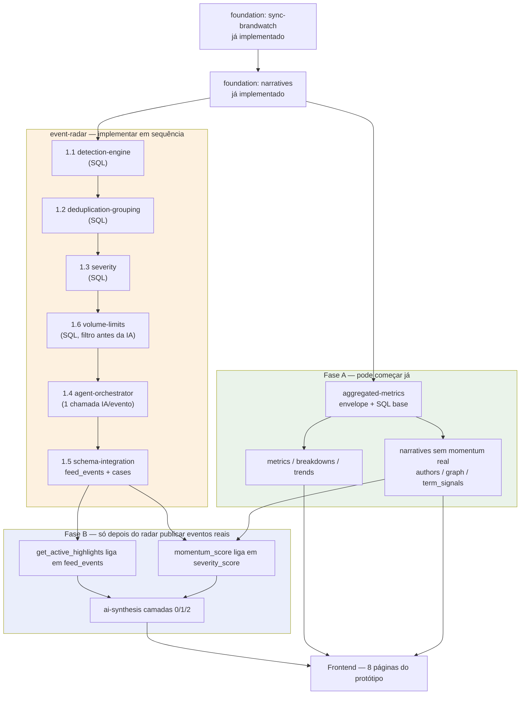
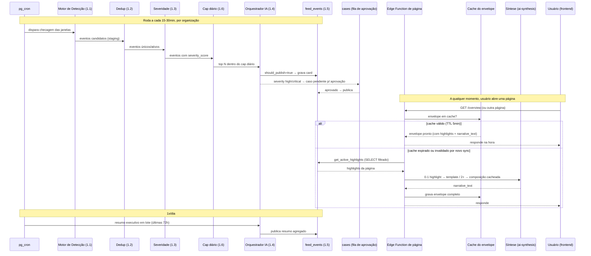
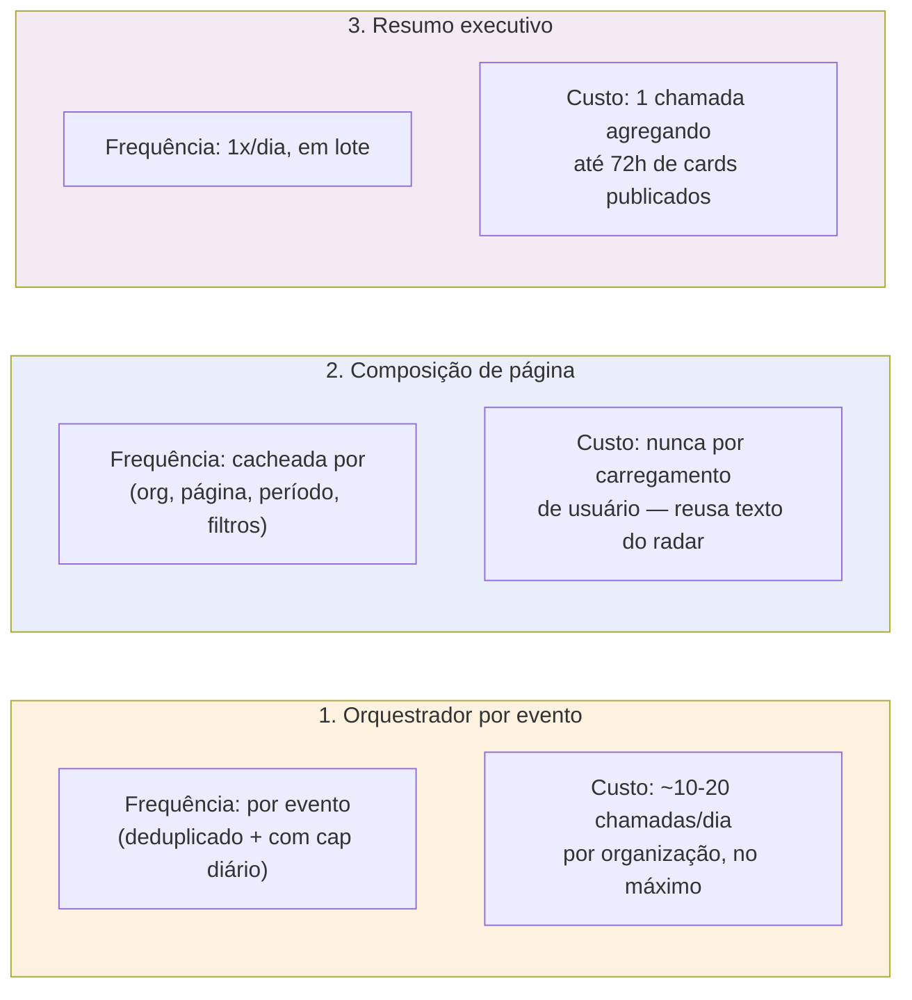

---
tipo: cross-module-flow
módulos: [event-radar, aggregated-metrics]
atualizado: 2026-07-12
---

# Fluxo e Sincronismo — Radar de Eventos ↔ Métricas Agregadas

Este documento existe para deixar visual o que está espalhado em texto nos dois módulos:
como o Radar de Eventos e as Métricas Agregadas se conectam, em que ordem devem ser
implementados, e com que frequência cada parte roda.

## 1. Dependência entre módulos e ordem de implementação

**Leitura prática**: `aggregated-metrics` (Fase A) e `event-radar` podem ser desenvolvidos em
paralelo por pessoas/sessões diferentes — a Fase A não trava esperando o radar. O que trava é
só a Fase B (highlights, narrative_text, momentum real), que só liga depois que
`event-radar` (1.1 → 1.6) estiver publicando eventos de verdade em `feed_events`.

## 2. Sincronismo — quando cada parte roda

**Pontos de atenção no sincronismo:**

- O radar roda **independente** de qualquer usuário estar olhando a tela — ele é um cron
  contínuo. As páginas só leem o que já está pronto em `feed_events`.
- O cache do envelope (TTL 5min) é invalidado antes do prazo quando: (a) um ciclo de sync da
  Brandwatch termina, ou (b) o usuário clica em "Atualizar dados". Ele NÃO é invalidado a cada
  novo evento do radar isoladamente — senão o cache perderia o sentido. Evento novo aparece na
  página no próximo ciclo de cache normal.
- A composição de `narrative_text` (quando há 2+ highlights) roda assíncrona e é cacheada junto
  do envelope — nunca é recalculada a cada usuário que abre a página.

## 3. Os três (e apenas três) pontos de chamada de IA da plataforma

Qualquer chamada de IA fora desses três pontos precisa de justificativa explícita no spec
correspondente (regra já definida em `event-radar/overview.md` e `aggregated-metrics/ai-synthesis.md`).

## Referências

- [event-radar/overview.md](event-radar/overview.md)
- [event-radar/aggregated-metrics-integration.md](event-radar/aggregated-metrics-integration.md)
- [aggregated-metrics/overview.md](aggregated-metrics/overview.md)
- [aggregated-metrics/ai-synthesis.md](aggregated-metrics/ai-synthesis.md)
