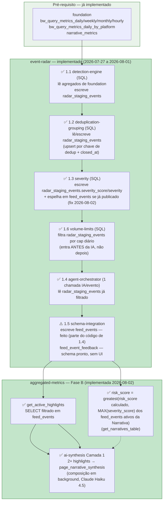
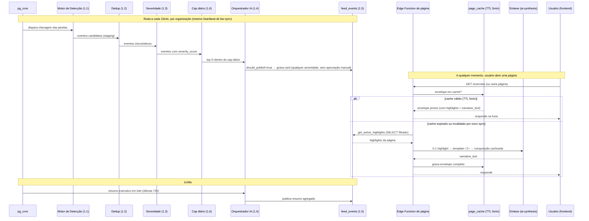
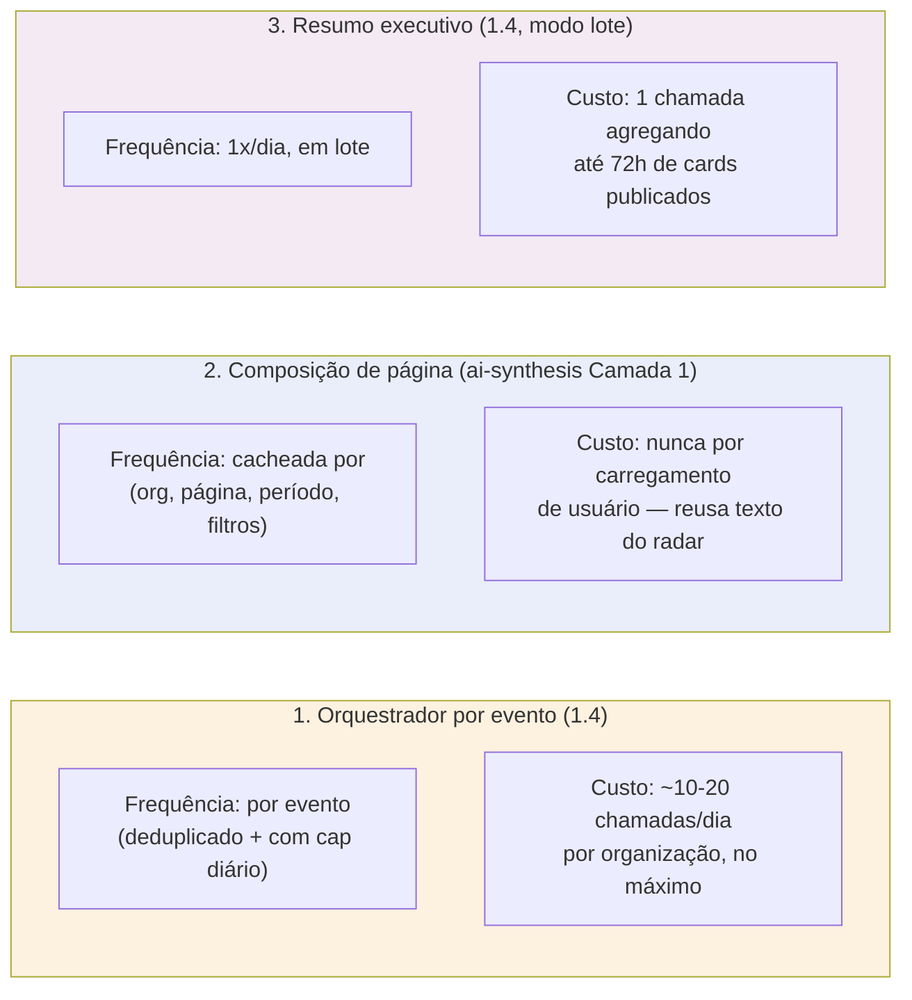

# Fluxo e Sincronismo — Radar de Eventos ↔ Métricas Agregadas

> ✅ **Movido de `.dev/specs/_fluxo-event-radar-aggregated-metrics.md` para dentro do diretório do
> próprio módulo (2026-07-25)**, a pedido do usuário — este documento é específico da integração
> `event-radar`↔`aggregated-metrics`, então vive melhor junto com o resto de `event-radar/*.md` do
> que solto na raiz de `.dev/specs/` ao lado dos arquivos verdadeiramente transversais
> (`_index.md`, `_architecture.md`, `_glossary.md`, `_pending.md`). Mesma sessão também redesenhou
> o diagrama de dependências (seção 1 abaixo) para deixar explícita a ordem de implementação
> interna do radar (1.1→1.6, já descrita em prosa em `overview.md`) e qual tabela cada etapa lê/
> escreve, agora que existe um `data-model.md` consolidado para consultar. Toda referência a este
> arquivo em `_index.md`/`_architecture.md`/`overview.md`/`aggregated-metrics-integration.md` foi
> atualizada para o novo caminho na mesma sessão.
>
> ✅ **R1–R6 implementados (2026-07-27 a 2026-08-01), diagrama revisado
> (2026-08-02)** — pedido do usuário: "algum ajuste para fazer na fase 2?"
> (Fase B, o subgrafo `AGG` abaixo), depois de ver o mesmo diagrama desta
> seção. O gate "só depois de R6 publicar eventos reais" **está satisfeito**
> — `feed_events` existe e está sendo populada desde 2026-07-31. Achado
> real ao revisar antes de liberar a Fase B: A2 (`risk_score` boost) lê
> `severity_score` de `feed_events` (o evento tem que estar **publicado**,
> não só detectado — ver nota em "Tabelas por etapa" abaixo), mas
> `feed_events.severity_score` só era gravado uma vez, no momento da
> publicação (1.4) — 1.3 (`severity`) recalcula `severity_score` em
> `radar_staging_events` a cada ciclo de 15min pra todo evento ativo,
> publicado ou não, então um card publicado ficava com severidade cada vez
> mais desatualizada enquanto o evento de origem seguisse ativo. Corrigido
> na migration `20260802000000` — mais um espelhamento dentro de
> `run_event_detection()` (mesmo padrão já usado pra `closed_at`,
> migration `20260731020000`), rodando logo depois de 1.3, na mesma
> transação. Ver `CLAUDE.md`, "Módulo `event-radar`", pro detalhe
> completo.
>
> ✅ **A1/A2/A3 implementados (2026-08-02, mesma sessão, "Sim, vamos
> prosseguir com a fase b")** — migrations `20260802010000`
> (`get_active_highlights` + boost de `risk_score`) e `20260802020000`
> (`page_narrative_synthesis`), mais a lógica de composição/background em
> `aggregated-metrics-service.ts` (Camada 1 de `ai-synthesis.md`),
> propagada às 7 Edge Functions `get-page-*`/`get-narrative-detail`. A1 não
> implementou o `JOIN radar_staging_events` para escopo por plataforma
> mencionado na tabela abaixo — nenhuma página hoje passa um filtro de
> plataforma pro bloco `highlights` (só `filters.narratives` é de fato
> usado em todo o módulo `aggregated-metrics`), então esse join foi
> deliberadamente adiado até existir um consumidor real — ver a própria
> linha de A1 na tabela, atualizada para refletir isso.

Este documento existe para deixar visual o que está espalhado em texto nos dois módulos: como o
Radar de Eventos e as Métricas Agregadas se conectam, **em que ordem cada peça deve ser
construída**, e com que frequência cada parte roda em produção. Se você está pegando este módulo
para implementar, comece pela seção 1 — ela é a ordem de trabalho, não só um diagrama decorativo.

## 1. Ordem de implementação e dependências entre módulos

> Lê-se de cima para baixo, esquerda para direita. Cada caixa numerada (1.1–1.6) é uma sessão de
> implementação própria (uma spec por sessão, skill `spec-driven-dev`) — não pular etapa, cada uma
> consome a saída da anterior. Ver [overview.md](overview.md), "Ordem de implementação (dentro do
> módulo)" para a mesma ordem em prosa.

**O que já existe vs. o que este diagrama cobre**: `aggregated-metrics` (Fase A — `metrics`,
`breakdowns`, `trends`, `narratives` com `sentiment`/`momentum_score`/`trend_score`/`risk_score`
já calculados 100% a partir de `foundation`, `authors`, `graph`, `term_signals`) **já está
implementado e não aparece aqui** — ver `CLAUDE.md`, "aggregated-metrics module (Sprint 2)". Este
diagrama cobre a parte que dependia do radar existir primeiro: o radar em si (R1–R6) e os três
pontos onde, depois de implementado, ele passa a alimentar `aggregated-metrics` (A1–A3, "Fase B") —
ambos os subgrafos estão implementados desde 2026-08-02.

**Tabelas por etapa** (ver [data-model.md](data-model.md) para o schema completo):

| Etapa | Lê | Escreve |
|---|---|---|
| 1.1 detection-engine | `bw_query_metrics_daily`/`weekly`/`monthly`/`hourly`/`_by_platform`, `narrative_metrics` | `radar_staging_events` (INSERT) |
| 1.2 deduplication-grouping | `radar_staging_events` (linhas novas) | `radar_staging_events` (UPDATE se já ativo, INSERT se novo, `closed_at` se encerrado) — cascade pra `feed_events.closed_at` do card vinculado |
| 1.3 severity | `radar_staging_events` (ativos deduplicados) | `radar_staging_events.severity_score`/`severity` (UPDATE) — ✅ **cascade pra `feed_events.severity_score`/`severity` (migration `20260802000000`)**, quando o `radar_staging_events` já tiver um `feed_events` vinculado e ainda ativo |
| 1.6 volume-limits | `radar_staging_events` (candidatos com severidade), contagem do dia em `feed_events` | nenhuma (só filtra o que segue para 1.4) |
| 1.4 agent-orchestrator | `radar_staging_events` (já filtrado pelo cap) | via 1.5 |
| 1.5 schema-integration | saída estruturada do agent | `feed_events` (INSERT, qualquer severidade — já implementado, dentro do próprio código de 1.4), `feed_event_feedback` (INSERT direto do cliente, assíncrono, vindo do analista — schema pronto, sem UI ainda) |
| A1 `get_active_highlights` | ✅ **Implementada (migration `20260802010000`)** — `feed_events`, filtrado por `organization_id`/`created_at` (período)/`filters.narratives`. ⚠️ Escopo por plataforma **não** implementado — exigiria `JOIN radar_staging_events` via `feed_events.radar_staging_event_id` pra recuperar `scope_type`/`scope_id` (`feed_events` não duplica essas colunas); adiado porque nenhuma página hoje passa um filtro de plataforma pro bloco `highlights` (só `filters.narratives` é wired em `aggregated-metrics`) | nenhuma (leitura pura) |
| A2 `risk_score` boost | ✅ **Implementada (migration `20260802010000`)** — `feed_events` **apenas** (nunca `radar_staging_events` direto — só evento **publicado** conta) — `MAX(severity_score)` entre os `feed_events` com `related_narrative_id = narrativa` e `closed_at IS NULL` | nenhuma (calculado sob demanda em `get_narratives_table`, `create or replace` sem mudar a assinatura) |
| A3 `ai-synthesis` Camada 1 | ✅ **Implementada (migration `20260802020000` + `aggregated-metrics-service.ts`)** — `feed_events.summary`/`explanation` (2+ highlights), composição via Claude Haiku 4.5 disparada em background (`scheduleBackground`/`EdgeRuntime.waitUntil`), nunca bloqueia a resposta da página | `page_narrative_synthesis` |

## 2. Sincronismo — quando cada parte roda

**Pontos de atenção no sincronismo:**

- ⚠️ **O "resumo executivo em lote (últimas 72h)" no rodapé do diagrama acima NÃO está
  implementado** — `agent-orchestrator.md` menciona essa feature ("antigo Agent 4") como
  rodando separado, em lote, mas nunca a descreveu no próprio "Fluxo principal" desse arquivo;
  ficou deliberadamente fora do escopo de 1.4 (ver `CLAUDE.md`, "Módulo `event-radar`",
  2026-07-31). Quem vem depois consultar este diagrama: essa parte do fluxo é aspiracional, não
  uma promessa de código já existente — não confundir com o widget "Radar de Eventos" (últimas
  72h) especificado em `frontend-highlights-feed.md`, que é uma **leitura** direta de
  `feed_events` pelo frontend, não uma terceira chamada de IA em lote.
- O radar roda **independente** de qualquer usuário estar olhando a tela — ele é um cron
  contínuo. As páginas só leem o que já está pronto em `feed_events`.
- ⚠️ **Correção (2026-08-02)**: o diagrama acima ("alt cache válido") descreve o desenho original
  de `page_cache`, mas essa tabela está **desabilitada** desde 2026-07-14 (`getPageEnvelopeWithCache`
  chama `assemblePageResponse` direto, sem ler/gravar `page_cache` — ver `CLAUDE.md`, "aggregated-metrics
  module (Sprint 2)"). Na prática hoje o branch "cache expirado ou invalidado" roda em **toda**
  requisição — um evento novo do radar aparece na página imediatamente na próxima requisição, não
  só quando um TTL expira. Consequência real pra A3: sem `page_cache` de-duplicando requisições,
  duas requisições quase simultâneas pra uma chave `(organization_id, page, period_start,
  period_end, filters_hash)` que ainda não tem linha em `page_narrative_synthesis` podem ambas
  disparar `composeAndPersistLayer1` em background antes da primeira terminar e gravar — no máximo
  2-3 chamadas de IA duplicadas nesse curto intervalo (não um loop, a segunda escrita só faz
  `upsert` sobre a mesma linha), aceito como trade-off de MVP dado o volume de tráfego atual; não
  implementado um lock distribuído pra isso. Reavaliar se `page_cache` for reativado (`_pending.md`
  gap #21) ou se o volume de requisições simultâneas crescer.
- A composição de `narrative_text` (quando há 2+ highlights) roda assíncrona e é cacheada em
  `page_narrative_synthesis` — nunca é recalculada a cada usuário que abre a página (ver
  [../aggregated-metrics/ai-synthesis.md](../aggregated-metrics/ai-synthesis.md)).

## 3. Os três (e apenas três) pontos de chamada de IA da plataforma

Qualquer chamada de IA fora desses três pontos precisa de justificativa explícita no spec
correspondente (regra já definida em `event-radar/overview.md` e `aggregated-metrics/ai-synthesis.md`).

## Referências

- [overview.md](overview.md) — "Ordem de implementação (dentro do módulo)", mesma sequência 1.1–1.6 em prosa
- [data-model.md](data-model.md) — schema completo de `radar_staging_events`/`feed_events`/`feed_event_feedback`
- [aggregated-metrics-integration.md](aggregated-metrics-integration.md) — contrato de campos ponto a ponto
- [../aggregated-metrics/overview.md](../aggregated-metrics/overview.md)
- [../aggregated-metrics/ai-synthesis.md](../aggregated-metrics/ai-synthesis.md)
- [../aggregated-metrics/sql-aggregation.md](../aggregated-metrics/sql-aggregation.md)
