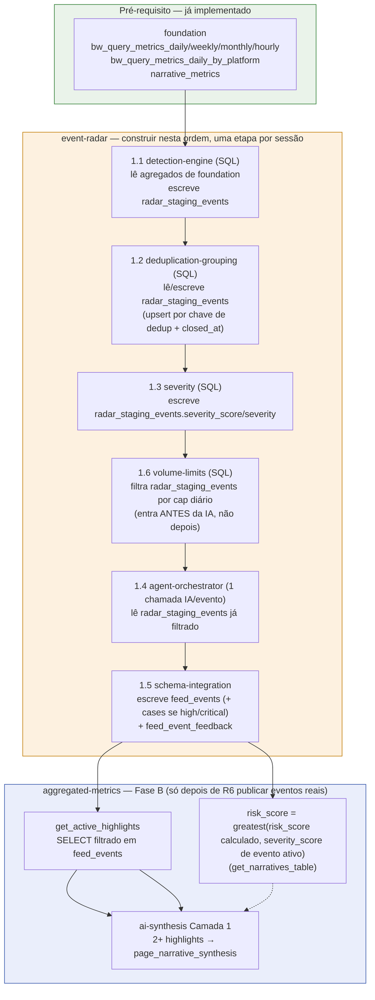
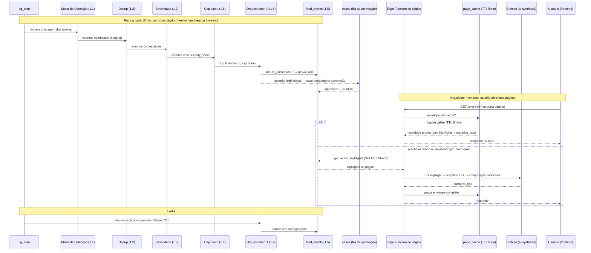
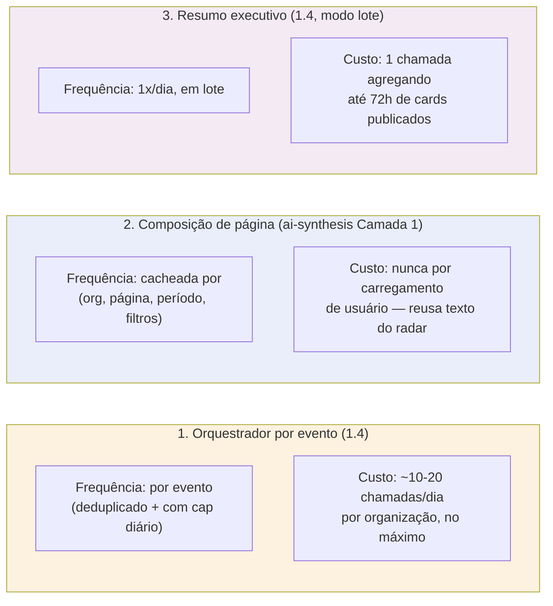

# Fluxo e Sincronismo — Radar de Eventos ↔ Métricas Agregadas

> ✅ **Movido de `.dev/specs/_fluxo-event-radar-aggregated-metrics.md` para dentro do diretório do
> próprio módulo (2026-07-25)**, a pedido do usuário — este documento é específico da integração
> `event-radar`↔`aggregated-metrics`, então vive melhor junto com o resto de `event-radar/*.md` do
> que solto na raiz de `.dev/specs/` ao lado dos arquivos verdadeiramente transversais
> (`_index.md`, `_architecture.md`, `_glossary.md`, `_pending.md`). Mesma sessão também redesenhou
> o diagrama de dependências (seção 1 abaixo) para deixar explícita a ordem de implementação
> interna do radar (1.1→1.6, já descrita em prosa em `overview.md`) e qual tabela cada etapa lê/
> escreve, agora que existe um `data-model.md` consolidado para consultar. Toda referência a este
> arquivo em `_index.md`/`_architecture.md`/`overview.md`/`aggregated-metrics-integration.md` foi
> atualizada para o novo caminho na mesma sessão.

Este documento existe para deixar visual o que está espalhado em texto nos dois módulos: como o
Radar de Eventos e as Métricas Agregadas se conectam, **em que ordem cada peça deve ser
construída**, e com que frequência cada parte roda em produção. Se você está pegando este módulo
para implementar, comece pela seção 1 — ela é a ordem de trabalho, não só um diagrama decorativo.

## 1. Ordem de implementação e dependências entre módulos

> Lê-se de cima para baixo, esquerda para direita. Cada caixa numerada (1.1–1.6) é uma sessão de
> implementação própria (uma spec por sessão, skill `spec-driven-dev`) — não pular etapa, cada uma
> consome a saída da anterior. Ver [overview.md](overview.md), "Ordem de implementação (dentro do
> módulo)" para a mesma ordem em prosa.

**O que já existe vs. o que este diagrama cobre**: `aggregated-metrics` (Fase A — `metrics`,
`breakdowns`, `trends`, `narratives` com `sentiment`/`momentum_score`/`trend_score`/`risk_score`
já calculados 100% a partir de `foundation`, `authors`, `graph`, `term_signals`) **já está
implementado e não aparece aqui** — ver `CLAUDE.md`, "aggregated-metrics module (Sprint 2)". Este
diagrama cobre só a parte que falta: o radar em si (R1–R6) e os três pontos onde, depois de
implementado, ele passa a alimentar `aggregated-metrics` (A1–A3, "Fase B").

**Tabelas por etapa** (ver [data-model.md](data-model.md) para o schema completo):

| Etapa | Lê | Escreve |
|---|---|---|
| 1.1 detection-engine | `bw_query_metrics_daily`/`weekly`/`monthly`/`hourly`/`_by_platform`, `narrative_metrics` | `radar_staging_events` (INSERT) |
| 1.2 deduplication-grouping | `radar_staging_events` (linhas novas) | `radar_staging_events` (UPDATE se já ativo, INSERT se novo, `closed_at` se encerrado) |
| 1.3 severity | `radar_staging_events` (ativos deduplicados) | `radar_staging_events.severity_score`/`severity` (UPDATE) |
| 1.6 volume-limits | `radar_staging_events` (candidatos com severidade), contagem do dia em `feed_events` | nenhuma (só filtra o que segue para 1.4) |
| 1.4 agent-orchestrator | `radar_staging_events` (já filtrado pelo cap) | via 1.5 |
| 1.5 schema-integration | saída estruturada do agent | `feed_events` (INSERT), `cases` (INSERT, só `high`/`critical`), `feed_event_feedback` (INSERT, assíncrono, vindo do analista) |
| A1 `get_active_highlights` | `feed_events` | nenhuma (leitura pura) |
| A2 `risk_score` boost | `feed_events`/`radar_staging_events.severity_score` (evento ativo da Narrativa) | nenhuma (calculado sob demanda em `get_narratives_table`) |
| A3 `ai-synthesis` Camada 1 | `feed_events.summary`/`explanation` (2+ highlights) | `page_narrative_synthesis` |

## 2. Sincronismo — quando cada parte roda

**Pontos de atenção no sincronismo:**

- O radar roda **independente** de qualquer usuário estar olhando a tela — ele é um cron
  contínuo. As páginas só leem o que já está pronto em `feed_events`.
- ✅ **`page_cache` já existe** (migration `20260725040000`, ver `CLAUDE.md`) — o TTL de 5min é
  real hoje; a invalidação antecipada (sync concluiu um ciclo / usuário clicou "Atualizar dados")
  ainda não está implementada (`_pending.md` gap #21) — evento novo do radar aparece na página só
  quando o TTL de 5min expirar naturalmente, não instantaneamente.
- A composição de `narrative_text` (quando há 2+ highlights) roda assíncrona e é cacheada em
  `page_narrative_synthesis` — nunca é recalculada a cada usuário que abre a página (ver
  [../aggregated-metrics/ai-synthesis.md](../aggregated-metrics/ai-synthesis.md)).

## 3. Os três (e apenas três) pontos de chamada de IA da plataforma

Qualquer chamada de IA fora desses três pontos precisa de justificativa explícita no spec
correspondente (regra já definida em `event-radar/overview.md` e `aggregated-metrics/ai-synthesis.md`).

## Referências

- [overview.md](overview.md) — "Ordem de implementação (dentro do módulo)", mesma sequência 1.1–1.6 em prosa
- [data-model.md](data-model.md) — schema completo de `radar_staging_events`/`feed_events`/`feed_event_feedback`
- [aggregated-metrics-integration.md](aggregated-metrics-integration.md) — contrato de campos ponto a ponto
- [../aggregated-metrics/overview.md](../aggregated-metrics/overview.md)
- [../aggregated-metrics/ai-synthesis.md](../aggregated-metrics/ai-synthesis.md)
- [../aggregated-metrics/sql-aggregation.md](../aggregated-metrics/sql-aggregation.md)
